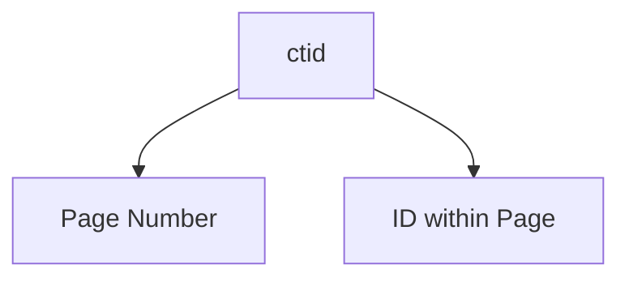

# Multi Version Concurrency Control


## Introduction
Postgres can store multiple versions of a row in a table. These hidden columns are used to handle the `visibility` of these versions in the running transaction request. There are hidden columns in every table which are;

1. `ctid`: unique row identifier. It is made up of a page number and an ID within that page.


2. `xmin`: identifier for the transaction that created the row. It can change if the row is updated.
3. `xmax`: identifier for the transaction that deleted the row. When `xmax` is set, the row is considered deleted.
4. `xvac`: identifier for the transaction that vacuumed the row

To see these tables we use the following query:

```sql
SELECT ctid, xmin, xmax, * FROM <table_name>;
```


----

## Transaction Isolation Levels
Isolation states how each transaction interacts with other transactions while running concurrently. It determines the visibility of data changes made by other transactions. We can tune this in several ways:

1. Read Committed 
2. Repeatable Read
3. Read Uncommitted
4. Serializable

<details> 
<summary><b>Read Committed<b></summary>
This isolation ensures that a transaction only reads committed data. Meaning it is possible two reads within the same transaction sees different data. 
    
  #### Practical Flow (MySQL)
  1. set transaction isolation level to READ COMMITTED
  ```sql
  SET TRANSACTION ISOLATION LEVEL READ COMMITTED;
  ```
  2. Start two `session_1`, `session_2` and start transaction in each sessions.
  ```sql
  START TRANSACTION;
  ```
    
  Assuming the current state of the database is as follows:
    
  ```
  +----+-------+
  | id | name  |
  |----+-------|
  | 1  | David |
  +----+-------+
  ```
    
  3. Update `name` to 'John Doe' in `session_1`.
  ```sql
  UPDATE users SET name = 'John Doe' WHERE id = 1;
  ```
  _NOTE: this is within a transaction_
  
  ```
  +----+----------+
  | id | name     |
  |----+----------|
  | 1  | John Doe |
  +----+----------+
  ```
    
  4. Read data table from `session_2`
  ```sql
  SELECT * FROM users;
  ```
    
  ```
  +----+----------+
  | id | name     |
  |----+----------|
  | 1  | David    |
  +----+----------+
  ```
    
  We still get *David* as the result, this is because the transaction is still open, i.e not `COMMITED`.
    
  5. Commit the transaction in `session_1`
  ```sql
  COMMIT;
  ```
    
  5. Read data table from `session_2`
  ```sql
  SELECT * FROM users;
  ```
    
  ```
  +----+----------+
  | id | name     |
  |----+----------|
  | 1  | John Doe |
  +----+----------+
  ```
    
  Now we see the updated data in `session_2`, The difference between **READ COMMITTED** and **REPEATABLE READ** is that all reads within the same transaction is consistent for **REPEATABLE READ**, but not for **READ COMMITTED**. 
  In **READ COMMITTED**, each read within a transaction is consistent with the state of the database at the time of the read, but not necessarily consistent with the state of the database at the time of the transaction's start. In **REPEATABLE READ**, each read within a transaction is consistent with the state of the database at the time of the transaction's start, but not necessarily consistent with the state of the database at the time of the transaction's commit.
    
  <br/>
  <br/>
  <br/>
    
    
  > "Because Read Committed mode starts each command with a new snapshot that includes all transactions committed up to that instant, subsequent commands in the same transaction will see the effects of the committed concurrent transaction in any case. The point at issue above is whether or not a single command sees an absolutely consistent view of the database.The partial transaction isolation provided by Read Committed mode is adequate for many applications, and this mode is fast and simple to use; however, it is not sufficient for all cases. Applications that do complex queries and updates might require a more rigorously consistent view of the database than Read Committed mode provides." -- [Postgres Transaction Isolation](https://www.postgresql.org/docs/current/transaction-iso.html)
</details>

<details> 
<summary><b>Repeatable Read<b></summary>

This isolation ensures that a transaction has consistent values for the same read within a trnasaction. It is not affected by other updates from other transactions.

#### Practical Flow (MySQL)
1. Set transaction isolation level to REPEATABLE READ
```sql
SET TRANSACTION ISOLATION LEVEL REPEATABLE READ;
```
2. Open two mysql sessions `session_1` and `session_2`
3. Create db and table eg. testdb and users table (id int, name varchar(255))
3. insert data into users from `session_1`. 
  ```sql 
  INSERT INTO users (name) VALUES (1, 'John');
  ```
4. Ensure you can see the data from `session_1` and `session_2` by running `SELECT * FROM users;` in both sessions.
5. Start a transaction in  `session_1` & `session_2`  then update the name of John to 'John Doe' in `session_1`
```sql
START TRANSACTION;
UPDATE users SET name = 'John Doe' WHERE id = 1;
```
6. Try reading the data from `session_2` while the transaction is not committed 
```sql
SELECT * FROM users;
```
You see the table and wonder, oh is it because we didn't commit the transaction in `session_1`🤔? Lets do that
```
+----+----------+
| id | name     |
+----+----------+
| 1  | John     |
+----+----------+
```
7. In `session_1` commit the transaction
```sql
COMMIT;
```
8. Try reading the data from `session_2` again, 
```
+----+----------+
| id | name     |
+----+----------+
| 1  | John     |
+----+----------+
```
You still get the same result, why is that? because in `REPEATABLE READS` isolation level, all reads within a transaction are consistent and it is not affected by changes made by other transactions. Meaning if at the start of the transaction (in both sessions) the name was `John` in both sessions, then `session_1` updates it to `John Doe`, `session_2` will still see the name as `John` until it `COMMIT` its own transaction.

</details>

<details>
<summary><b>Read Uncommitted<b></summary>
This isolation level allows transactions to read uncommitted data. It is the least restrictive isolation level and can lead to dirty reads, non-repeatable reads, and phantom reads.

Dirty Read will occur when a transaction reads data that has been modified but not committed by another transaction. This can lead to inconsistent data and should be avoided. eg ROLLBACK command is applied

Non-repeatable Read will occur when a transaction reads the same row twice and gets different values. This can happen if another transaction commits a change between the two reads.

Phantom Read will occur when a transaction reads a range of rows and gets different results. This can happen if another transaction inserts a row into the range between the two reads.

#### Practical Flow (MySQL)
  1. set transaction isolation level to READ UNCOMMITTED
  ```sql
  SET TRANSACTION ISOLATION LEVEL READ UNCOMMITTED;
  ```
  2... follow through with examples used in previous isolation levels

**POSTGRESQL** does not support `READ UNCOMMITTED` isolation level
</details>

<details>
<summary><b>Serializable</b></summary>
This isolation levels garauntes a consistent state across all reads. Serializable is the strictest isolation level among the three. What this does is that when a transaction writes (insert/update) to a particular table it obtains a `LOCK` and every other transaction is blocked until the current transaction is commited or rollback. This posses a serious performance issue actually.

### Practical Flow (MySQL)
To experience this change your isolation level to `SERIALIZABLE` and try the same steps in previous examples.
```sql
SET TRANSACTION ISOLATION LEVEL SERIALIZABLE;
```

</details>


* [Link to my practice](https://github.com/tdadadavid/pg-mvcc)

Resources:
1. [Denis Magada - Github](https://github.com/dmagda/DevMastersDb/blob/main/postgres/postgres_mvcc_backstage.md#js-repo-pjax-container)
2. [MVCC - Denis Magada](https://www.youtube.com/watch?v=TBmDBw1IIoY)
3. [Isolation Anomalies in PostgreSQL](https://pgdash.io/blog/isolation-anomalies-in-postgresql.html)
4. [Transaction Isolation in Postgres, explained](https://www.thenile.dev/blog/transaction-isolation-postgres) (not read)
5. [Serialiable Snapsot Isolation - Video](https://www.youtube.com/watch?v=4TAKYRzm_dA) (not watched)
6. [Serializable Snapshot Isolation - Article](https://tech-lessons.in/en/blog/serializable_snapshot_isolation/)
