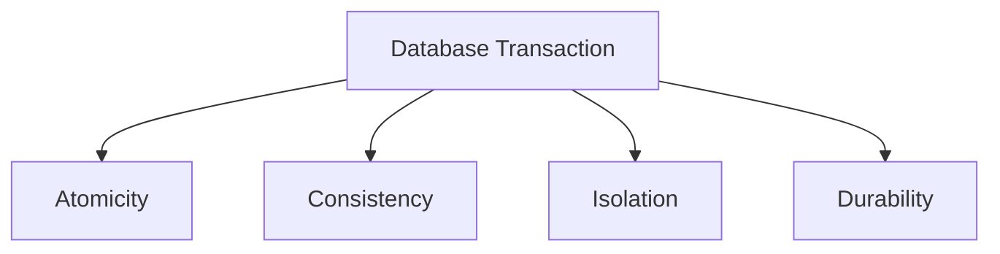

# Relation Databases

Key properties of Relation Databases:

1. Data Consistency
2. Constraints
3. Data Durability
4. Data Integrity

---

## Transactions
These are operations that are executed at a unit of work. meaning if any operation fails everything fails. In postgres the operations are marked complete when they are committed (ie. written to disk).

In postgres a transaction is started by using the `BEGIN` keyword and marked completed by using the `COMMIT` keyword.

```sql
BEGIN;
    -- transaction block
COMMIT;
```

What if a transaction fails, then we issue a `ROLLBACK`. This instructs the database to revert to the previous state before the transaction began this ensures every update made by transaction block before the failure is reverted


> "...PostgreSQL actually treats every SQL statement as being executed within a transaction. If you do not issue a BEGIN command, then each individual statement has an implicit BEGIN and (if successful) COMMIT wrapped around it. A group of statements surrounded by BEGIN and COMMIT is sometimes called a transaction block." -- [Postgres Transactions Docs](https://www.postgresql.org/docs/current/tutorial-transactions.html)

While rolling back a transaction, you might want to rollback to a specific point in time within that transaction, You can use `SAVEPOINT` for that.

The syntax for using `SAVEPOINT` is as follows:

```sql
BEGIN;
 -- operation_1
 -- operation_2
 SAVEPOINT sp1;
 -- operation_3
 ROLLBACK TO SAVEPOINT sp1;
 -- operation_4
 COMMIT

```

[Reference for SAVEPOINT](https://www.postgresql.org/docs/current/sql-savepoint.html)
### Special cases when failure happens
> "Some PostgreSQL data types and functions have special rules regarding transactional behavior. In particular, changes made to a sequence (and therefore the counter of a column declared using serial) are immediately visible to all other transactions and are not rolled back if the transaction that made the changes aborts. See [Section 9.17](https://www.postgresql.org/docs/current/functions-sequence.html) and [Section 8.1.4](https://www.postgresql.org/docs/current/datatype-numeric.html#DATATYPE-SERIAL)."

---

## A C I D



1. *Atomicity*: All operations are executed at a unit of work. meaning if any operation fails everything fails. In postgres the operations are marked complete when they are committed (ie. written to disk).
> "...A transactional database guarantees that all the updates made by a transaction are logged in permanent storage (i.e., on disk) before the transaction is reported complete." -- [Postgres Transactions Docs](https://www.postgresql.org/docs/current/tutorial-transactions.html)

2. *Consistency*: This says that the data will never go into an incorrect state. They achieve this by enforcing constraints, constraints and triggers. Reference: [Postgres Constraints](https://www.postgresql.org/docs/current/ddl-constraints.html)

3. *Durability*: This says that no-matter the outage or failure of the system, the data will be persisted. Refer to [Postgres Durability](https://www.postgresql.org/docs/current/wal-intro.html)

4. *Isolation*: In the scenario where there are several concurrent transactions, they must be isolated from each other. This is achieved by using isolation levels. In most cases you don't need to worry about this as the database will handle it for you. We just go with what is called `Repeatable Reads`. Reference: [Postgres Isolation Levels](https://www.postgresql.org/docs/current/transaction-iso.html)
  ### Isolation Levels
  - Read Uncommitted
  - Read Committed
  - Repeatable Read
  - Serializable
