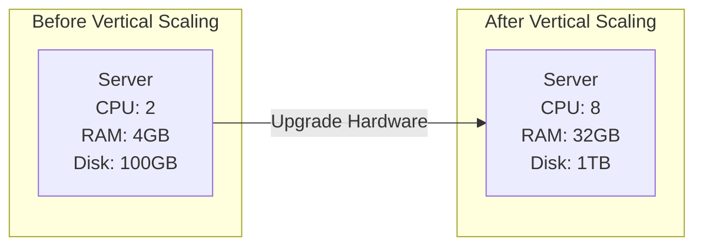
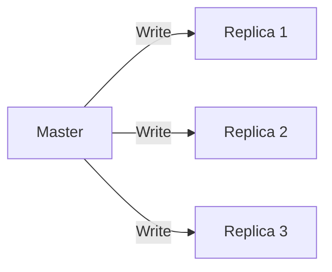

# Scaling Database

## Techniques for Scaling


### Vertical Scaling
This technique involves adding more hardware resources (CPU, RAM, Storage, Network Bandwidth, etc.).
It is actually the easiest approach to scale a database by simply adding more servers or nodes to the cluster. It has its limitations which basically _hardware limits_



### Horizontal Scaling
This technique involves _distributing_ load across several servers or nodes in a cluster. It is a better approach in most cases than vertical scalling.

```
graph LR
    A[Server 1] -->|Data| B[Server 2]
    B -->|Data| C[Server 3]
```

Horizontal Scaling is achieved using different techniques.

1. Read Replicas
2. Sharding

<details>
<summary><b> Read Replicas</b></summary>

Considering a well observed position in swe, most times the applications we build have more _read_ operations than _write_ operations. This is because most applications are read-heavy. Now we can use read replicas to distribute the load across multiple servers or nodes. Read replicas are copies of the primary database that are kept in sync with the primary database. They are used to handle read operations, which are typically more frequent than write operations. This allows us to scale our database horizontally without sacrificing performance.

This means we have 1 that acts a source of truth for other databases, this databases is called _master_ this is where all _write_ operations are performed, this also introduces a question of 
**consistency**, how do we ensure that the replicas have the updated data from the master?

How do we achieve this?
Just like in every standard distributed system, _consistency_ is divided into 2 types:

1. Strong Consistency
2. Eventual Consistency

<details open>
<summary> <b> Strong Consistency </b></summary>
In the case of strong consistency, the flow is typically when a _write_ is performed on the master, the write operation must be *immediately* performed as well on the _replicas_ meaning before the response is sent to the client that made the api request, we must write through the master and _replica_. Hmm this introduces a performace bottleneck on the api request making it slower. It has a benefit of being strictly consistent (replica.state() == master.state()) but it is not scalable.

To solve this problem, we can use a technique called _write-ahead logging_ (WAL)[https://www.postgresql.org/docs/current/wal.html]. WAL is a mechanism that allows us to log all write operations before they are applied to the database. This means that we can apply the write operations to the replicas in parallel, without waiting for the master to finish writing. This allows us to achieve strong consistency without sacrificing performance.


</details>

<details open>
<summary><b><Eventual Consistency></b></summary>
This typical flow for this is that the api sends request to the master, then responds to the api. Notice that the replica had not involvement in this process. Now how do we ensure that the replicas have the updated data from the master?

To achieve this, we can use a technique called _eventual consistency_. In this approach, the replicas are allowed to lag behind the master, but they will eventually catch up. This is achieved by periodically synchronizing the replicas with the master. This allows us to achieve high performance while sacrificing some consistency guarantees (some reads may be stale).

</details>

</details>
