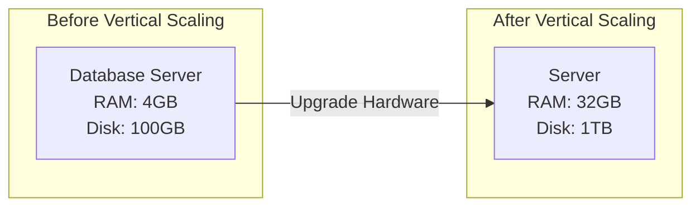
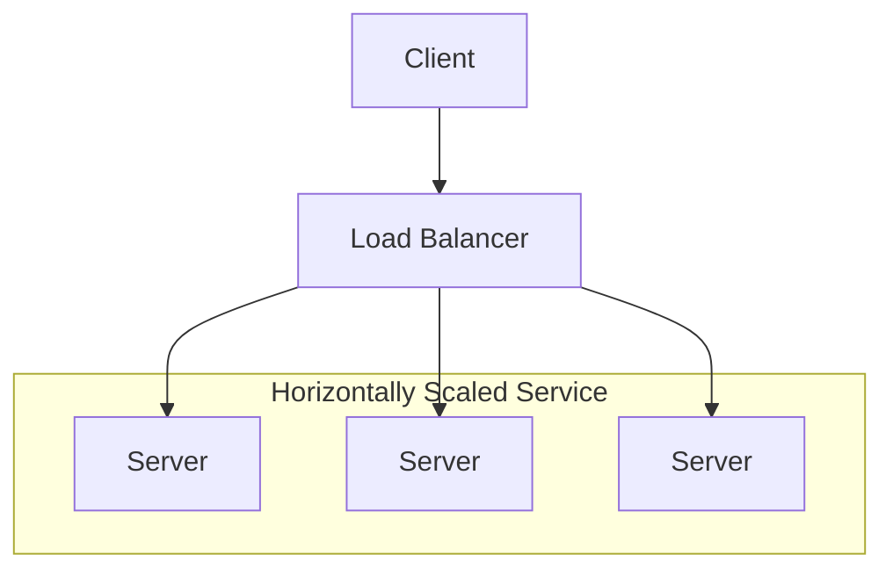
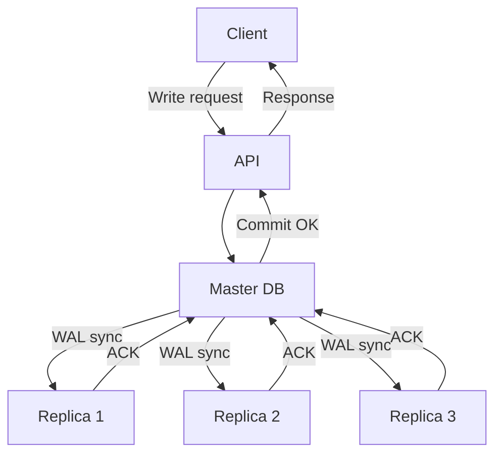
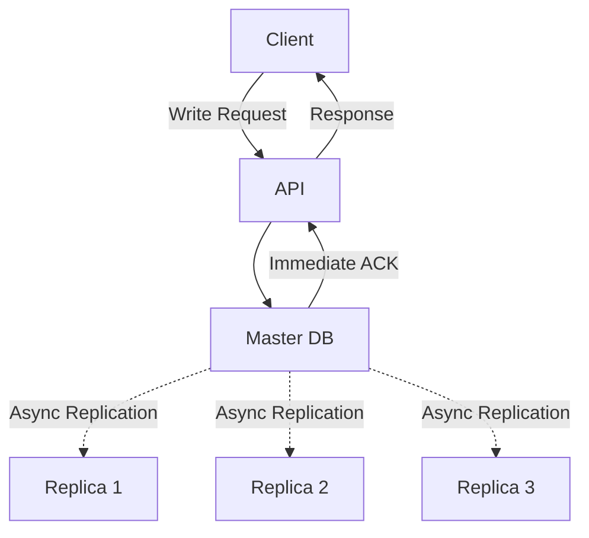

# Scaling Database

## Techniques for Scaling


### Vertical Scaling
This technique involves adding more hardware resources (CPU, RAM, Storage, Network Bandwidth, etc.).
It is actually the easiest approach to scale a database by simply adding more servers or nodes to the cluster. It has its limitations which basically _hardware limits_



### Horizontal Scaling
This technique involves _distributing_ load across several servers or nodes in a cluster. It is a better approach in most cases than vertical scalling.



Horizontal Scaling is achieved using different techniques.

1. Read Replicas
2. Sharding

<details>
<summary><b> Read Replicas</b></summary>

Considering a well observed position in swe, most times the applications we build have more __read__ operations than __write__ operations. This is because most applications are read-heavy. Now we can use read replicas to distribute the load across multiple servers or nodes. Read replicas are copies of the primary database that are kept in sync with the primary database. They are used to handle read operations, which are typically more frequent than write operations. This allows us to scale our database horizontally without sacrificing performance.

This means we have 1 that acts a source of truth for other databases, this databases is called __master__ this is where all __write__ operations are performed, this also introduces a question of 
**consistency**, how do we ensure that the replicas have the updated data from the master?

How do we achieve this?
Just like in every standard distributed system, __consistency__ is divided into 2 types:

1. Strong Consistency
2. Eventual Consistency

<details open>
<summary> <b> Strong Consistency </b></summary>
In the case of strong consistency, the flow is typically as follows:

When a WRITE operation is performed on the master, the write must be immediately applied to the replicas as well. This means that before the API response is sent back to the client, the system must ensure the write has been persisted on both the master and its replicas.

This approach guarantees strict consistency:
```go
	replica.State() == master.State()
```
However, it introduces a performance bottleneck. Since the API request must wait for multiple writes to complete, request latency increases. While this model provides strong correctness guarantees, it does not scale well under high write throughput.

#### How this can be solved?
To mitigate this issue, we can use a technique called Write-Ahead Logging (WAL).

WAL works by logging every write operation before it is applied to the database. Once the log entry is safely persisted, the system can immediately acknowledge the request to the client.

Key benefits of WAL:

- The master appends the write to the WAL and returns success.

- Replicas consume the WAL asynchronously.

- Replication happens in parallel, not inline with the API request.

- The system avoids blocking on replica writes during request handling.

This approach allows the system to preserve strong consistency semantics (no committed write is lost) without sacrificing performance or scalability.


</details>

<details open>
<summary><b>Eventual Consistency</b></summary>
This typical flow for this is that the api sends request to the master, then responds to the api. Notice that the replica had not involvement in this process. Now how do we ensure that the replicas have the updated data from the master?

To achieve this, we can use a technique called __eventual consistency__. In this approach, the replicas are allowed to lag behind the master, but they will eventually catch up. This is achieved by periodically synchronizing the replicas with the master. This allows us to achieve high performance while sacrificing some consistency guarantees (some reads may be stale).

</details>

</details>
