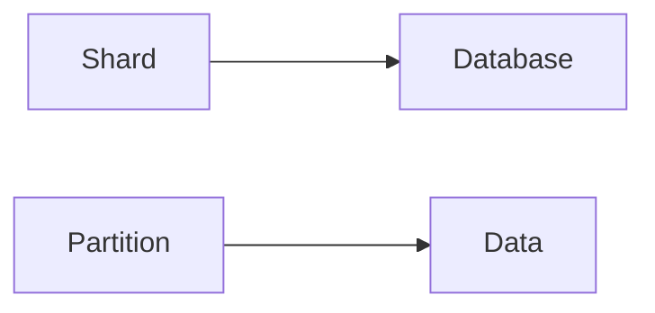
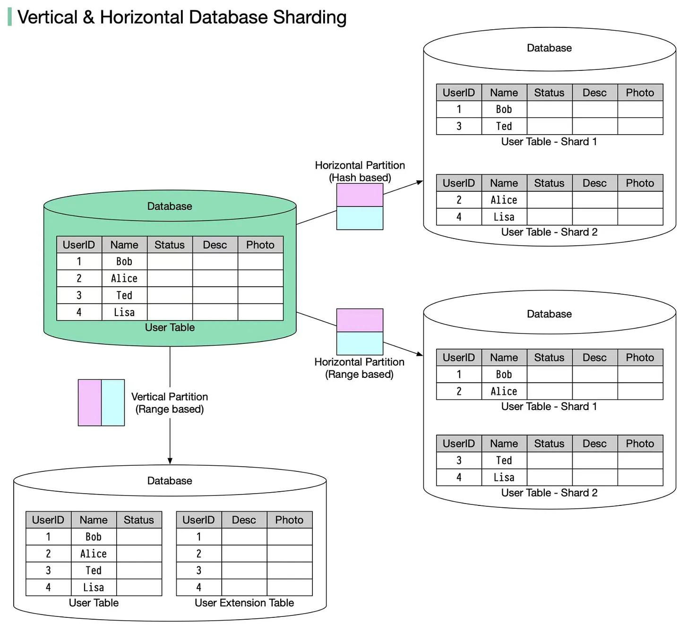

# Sharding & Partioning
****

Sharding is methods of `horizontal` scaling for databases. It involves splitting the data (`partitioning`)
among different database server called `shards`. Each shard contains a subset of the data.

A Partition is a `subset of the data` living in a single shard.

### Mental Block

Keys to consider when sharding
- Data distribution
- Business Query

## Partitioning

- Horizontal Partitioning (`rows`)
- Vertical Partitioning. (`columns`)

### Horizontal Partitioning (`rows`)
This has to do with moving `rows` from a table into another database entirely. Each database has the same number of colums
but has different rows. For example, a database with _1000_ records. We can move _500_ to `database_A` and _501-1000_ to `database_B`
Note that for each partition they have the same schema

### Vertical Partitioning (`columns`)
This has to do with moving `columns` of a table into another database. Meaning if we want to vertically partition user's information we can the 
user's `name, age and email` in `database_A` and user's `phoneNumber, address, work_experience` in `database_B`. Looking at this each partition has
its own schema.

Source: ByteByteGo, "Vertical vs Horizontal Partitioning" — https://blog.bytebytego.com/p/vertical-partitioning-vs-horizontal

## Summary Table
<table>
  <thead>
    <tr>
      <th>Sharding?</th>
      <th>Partitioning?</th>
      <th>What it means</th>
    </tr>
  </thead>
  <tbody>
    <tr>
      <td>No</td>
      <td>No</td>
      <td>Single database server; all data lives in one database.</td>
    </tr>
    <tr>
      <td>No</td>
      <td>Yes</td>
      <td>Single database server; data is split across separate databases (logical separation).</td>
    </tr>
    <tr>
      <td>Yes</td>
      <td>No</td>
      <td>Multiple instances containing the same data (equivalent to read replicas).</td>
    </tr>
    <tr>
      <td>Yes</td>
      <td>Yes</td>
      <td>Different data lives on different database servers (e.g., Order DB vs. Payments DB); common in microservices.</td>
    </tr>
  </tbody>
</table>

## Advantages
- Increased performance, as each shard can handle different loads.
- By sharding multiple rows, queries will need to go over *fewer* rows.

## Disadvantage
- Cross-shard queries are really expensive. Engineers should deeply reduce this. This can lead to `Distributed Transactions` and performance gets degraded.
- A problem can occur where a shard outgrows other shards in size (quantity of data). This is called `Hotspot`.

## Related Blogs read.
- [Horizontal vs. Vertical Partitioning](https://blog.bytebytego.com/p/vertical-partitioning-vs-horizontal)
- [Sharding strategies](https://blog.bytebytego.com/p/a-guide-to-database-sharding-key)
- [Shopify Shard Balancing](https://shopify.engineering/mysql-database-shard-balancing-terabyte-scale)
- [Partitioning GitHub Relational Databases to handle scale](https://github.blog/engineering/infrastructure/partitioning-githubs-relational-databases-scale/)
- [PlanetScale - Database Sharding](https://planetscale.com/blog/database-sharding)
- [Understanding Database Sharding](https://www.digitalocean.com/community/tutorials/understanding-database-sharding)
- [Scaling Etsy Payments with Vitess: Part 1 – The Data Model](https://www.etsy.com/codeascraft/scaling-etsy-payments-with-vitess-part-1--the-data-model)
- [Query Strikes Again -Slack](https://slack.engineering/the-query-strikes-again/)
- [Sharding @ Pinterest](https://medium.com/pinterest-engineering/sharding-pinterest-how-we-scaled-our-mysql-fleet-3f341e96ca6f)
- [Code Migration in Production: Rewriting the Sharding Layer of Uber’s Schemaless Datastore](https://www.uber.com/en-JP/blog/schemaless-rewrite/)
- [How sharding a database can make it faster](https://stackoverflow.blog/2022/03/14/how-sharding-a-database-can-make-it-faster/)