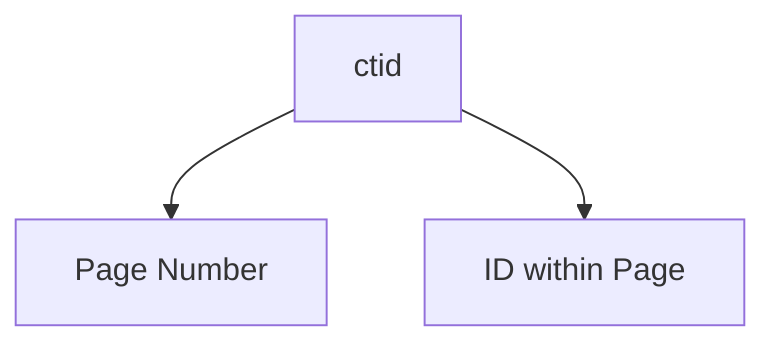

# Multi Version Concurrency Control


## Introduction
Postgres can store multiple versions of a row in a table. These hidden columns are used to handle the `visibility` of these versions in the running transaction request. There are hidden columns in every table which are;

1. `ctid`: unique row identifier. It is made up of a page number and an ID within that page.


2. `xmin`: identifier for the transaction that created the row. It can change if the row is updated.
3. `xmax`: identifier for the transaction that deleted the row. When `xmax` is set, the row is considered deleted.
4. `xvac`: identifier for the transaction that vacuumed the row

To see these tables we use the following query:

```sql
SELECT ctid, xmin, xmax, * FROM <table_name>;
```


Resources:
1. [Denis Magada - Github](https://github.com/dmagda/DevMastersDb/blob/main/postgres/postgres_mvcc_backstage.md#js-repo-pjax-container)
2. [MVCC - Denis Magada](https://www.youtube.com/watch?v=TBmDBw1IIoY)

----

## Transaction Isolation Levels
Isolation states how each transaction interacts with other transactions while running concurrently. It determines the visibility of data changes made by other transactions. We can tune this in several ways:

1. Read Uncommitted
2. Read Committed
3. Repeatable Read
4. Serializable

### Read Committed

> "Because Read Committed mode starts each command with a new snapshot that includes all transactions committed up to that instant, subsequent commands in the same transaction will see the effects of the committed concurrent transaction in any case. The point at issue above is whether or not a single command sees an absolutely consistent view of the database.The partial transaction isolation provided by Read Committed mode is adequate for many applications, and this mode is fast and simple to use; however, it is not sufficient for all cases. Applications that do complex queries and updates might require a more rigorously consistent view of the database than Read Committed mode provides." -- [Postgres Transaction Isolation](https://www.postgresql.org/docs/current/transaction-iso.html)

[Link to my practice](https://github.com/tdadadavid/pg-mvcc)


### Repeatable Read
This isolation ensures that a transaction has consistent values for the same read within a trnasaction. It is not affected by other updates from other transactions.

#### Practical Flow
1. Open two mysql sessions `session_1` and `session_2`
2. Create db and table eg. testdb and users table (id int, name varchar(255))
3. insert data into users from `session_1`. 
  ```sql 
  INSERT INTO users (name) VALUES (1, 'John');
  ```
4. Ensure you can see the data from `session_1` and `session_2` by running `SELECT * FROM users;` in both sessions.
5. Start a transaction in  `session_1` & `session_2`  then update the name of John to 'John Doe' in `session_1`
```sql
START TRANSACTION;
UPDATE users SET name = 'John Doe' WHERE id = 1;
```
6. Try reading the data from `session_2` while the transaction is not committed 
```sql
SELECT * FROM users;
```
You see the table and wonder, oh is it because we didn't commit the transaction in `session_1`🤔? Lets do that
```
+----+----------+
| id | name     |
+----+----------+
| 1  | John     |
+----+----------+
```
7. In `session_1` commit the transaction
```sql
COMMIT;
```
8. Try reading the data from `session_2` again, 
```
+----+----------+
| id | name     |
+----+----------+
| 1  | John     |
+----+----------+
```
You still get the same result, why is that? because in `REPEATABLE READS` isolation level, all reads within a transaction are consistent and it is not affected by changes made by other transactions. Meaning if at the start of the transaction (in both sessions) the name was `John` in both sessions, then `session_1` updates it to `John Doe`, `session_2` will still see the name as `John` until it `COMMIT` its own transaction.
