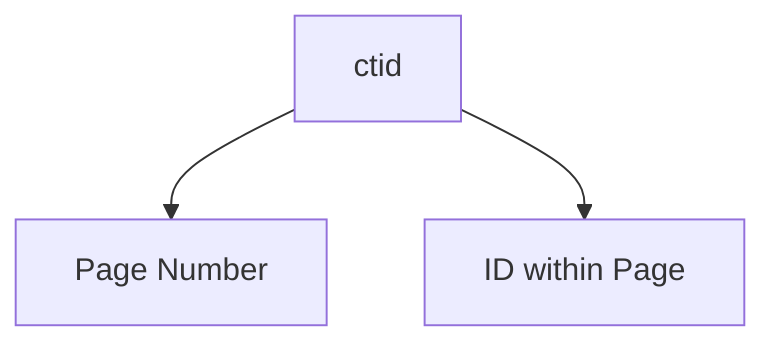

# Multi Version Concurrency Control


## Introduction
Postgres can store multiple versions of a row in a table. These hidden columns are used to handle the `visibility` of these versions in the running transaction request. There are hidden columns in every table which are;

1. `ctid`: unique row identifier. It is made up of a page number and an ID within that page.


2. `xmin`: identifier for the transaction that created the row. It can change if the row is updated.
3. `xmax`: identifier for the transaction that deleted the row. When `xmax` is set, the row is considered deleted.
4. `xvac`: identifier for the transaction that vacuumed the row

To see these tables we use the following query:

```sql
SELECT ctid, xmin, xmax, * FROM <table_name>;
```


Resources:
1. [Denis Magada - Github](https://github.com/dmagda/DevMastersDb/blob/main/postgres/postgres_mvcc_backstage.md#js-repo-pjax-container)
2. [MVCC - Denis Magada](https://www.youtube.com/watch?v=TBmDBw1IIoY)


## Transaction Isolation Levels

1. Read Uncommitted
2. Read Committed
3. Repeatable Read
4. Serializable

### Read Committed

> "Because Read Committed mode starts each command with a new snapshot that includes all transactions committed up to that instant, subsequent commands in the same transaction will see the effects of the committed concurrent transaction in any case. The point at issue above is whether or not a single command sees an absolutely consistent view of the database.The partial transaction isolation provided by Read Committed mode is adequate for many applications, and this mode is fast and simple to use; however, it is not sufficient for all cases. Applications that do complex queries and updates might require a more rigorously consistent view of the database than Read Committed mode provides." -- [Postgres Transaction Isolation](https://www.postgresql.org/docs/current/transaction-iso.html)

[Link to my practice](https://github.com/tdadadavid/pg-mvcc)


### Repeatable Read
